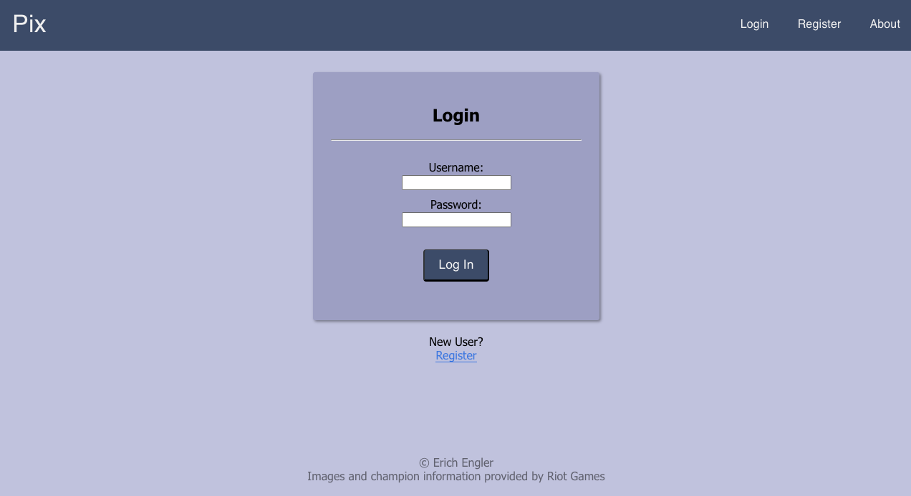
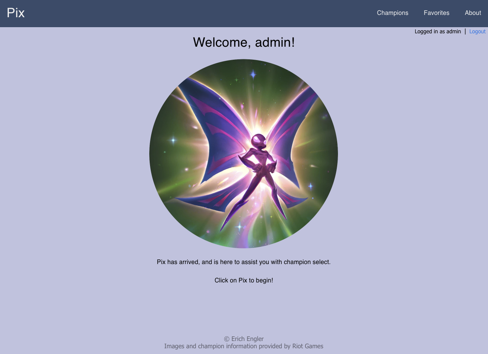
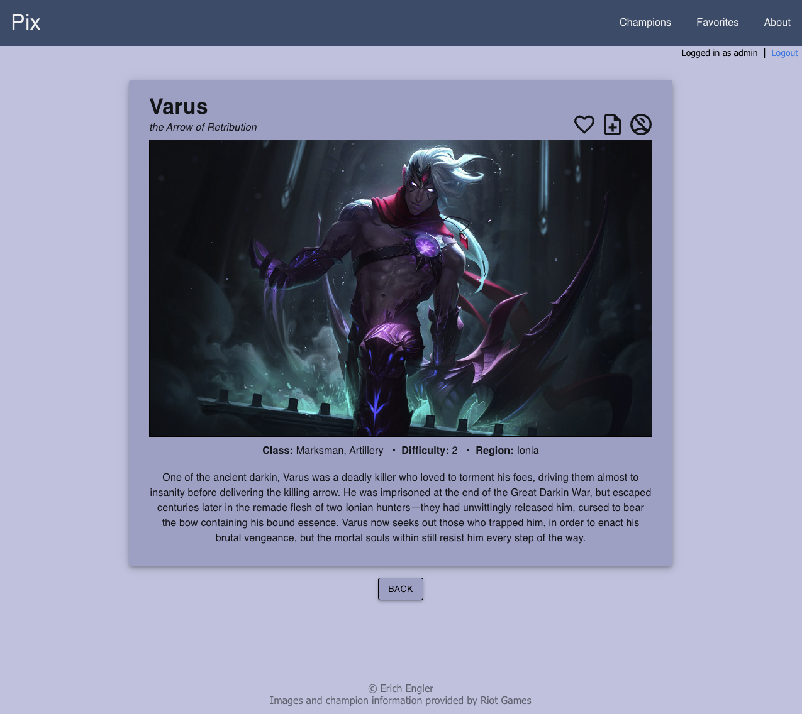
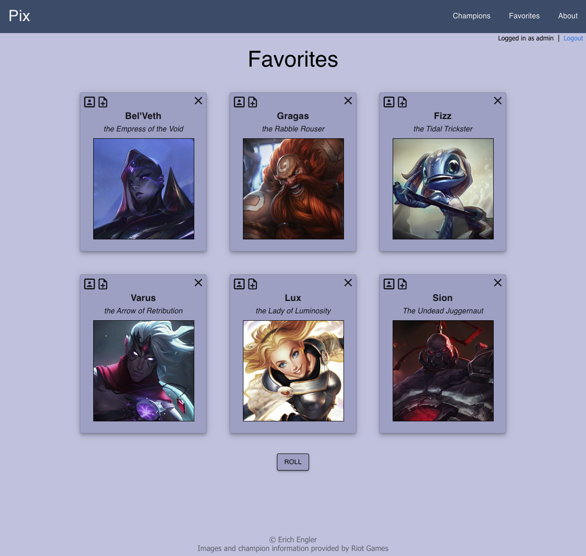
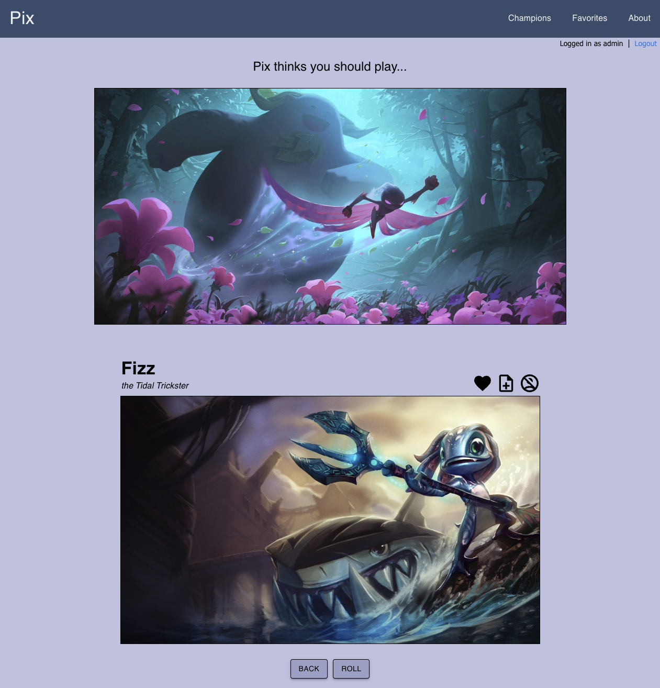

# Pix - Champion Selector

## Description

_Duration: 10-12 days of work over a 3 week period_

In the game League of Legends (made by Riot Games), there are currently over 160 playable characters (called champions) in the game, each with different abilities, a different playstyle, and a different story. Before each match, players are required to select one of these champions to play. This selection process can be incredibly overwhelming, especially for new players.

This application was designed to help players decide which champion to pick for their next League of Legends match. The selection can be random or based on a player's personal preferences, depending on which method they prefer. Pix was NOT designed to improve a player's in-game performance or increase their rank. Instead, my hope is that new players using Pix will be able to learn the game in a more fun and efficient way by easily keeping track of which champions they have tried so far and sorting those champions using the `Favorites` and `Blacklist` features of the app. Veterans of the game will also benefit from Pix by being able to create drafting strategies and reminders using the `Notes` feature.

## Preview


<br /><br />


<br /><br />


<br /><br />


<br /><br />


<br /><br />


<br /><br />



## Installation / Setup

1. Clone down this repository. You will need `node` and `npm` installed globally on your machine. Open it up in your editor of choice.
2. Create a database named `pix_app`.
3. Refer to the `database.sql` file and run the first 5 queries to create the database tables.

-----------------------------------------------------------------
- DO NOT run the rest of the queries yet! Only run the first 5 queries to create the database tables. We will return to run the rest of the queries in step 10.
-----------------------------------------------------------------

4. Run `npm install` in your terminal.
5. Create a `.env` file at the root of the project and paste this line into the file:
    ```
    SERVER_SESSION_SECRET=superDuperSecret
    ```
    While you're in your new `.env` file, take the time to replace `superDuperSecret` with some long random string of your choice.
6. Run `npm run server` in your terminal.
7. In a new terminal window, run `npm run client`.
8. Once the application is up and running, you will be required to register.
9. After registering, log in using your new username and password.

10. After logging in and landing on the User Page (You will be greeted by Pix at this point), the database will automatically populate every champion's `name`, `title`, `imageSplash`, `imageTile`, `imageSmall`, `difficulty` and `lore` from the Data Dragon API Library (by Riot Games).

-----------------------------------------------------------------
- At the time this application was created, the most recent Data Dragon version was `13.11.1`. This version contains 163 different champions from the game. Please ensure that all 163 champions are populated in the database before leaving the `User Page`. This may take up to a minute or so depending on your internet connection. If you leave the `User Page` before all the data is populated, please delete and recreate the `champions` database table and then return to the `User Page` to start the population process again.

- I will try to update this application when newer versions of Data Dragon are released by Riot Games. If I end up behind on this (quite likely), you may need to replace the version variables in `/src/data/fetchChampionNames.js` and `/src/redux/sagas/championInfo.saga.js` with the current version of Data Dragon. The application will still function on an older version, but you may encounter outdated information or missing champions that were added to the game in a newer version.

- You can visit this URL to find the latest version: `https://ddragon.leagueoflegends.com/api/versions.json` (The first number in the array is the newest version).
-----------------------------------------------------------------

11. After the database has been fully populated, refer back to the `database.sql` file and run the queries to update `difficulty` (where it is missing from), `class` and `region` in the champions table. 

-----------------------------------------------------------------
- At this point, if there is any missing information in the champions table (more likely if you had to update to a newer version), feel free to add your own values. 

- The class of a champion can be found at `https://leagueoflegends.fandom.com/wiki/(CHAMPION_NAME)/LoL`. Replace (CHAMPION_NAME) with the name of the champion.

- The region of a champion can be found at `https://www.leagueoflegends.com/en-us/champions/(CHAMPION_NAME)`. Replace (CHAMPION_NAME) with the name of the champion.
-----------------------------------------------------------------

## Usage

1. As a new user on the `Home` page, I will need to register to use the application. I can click the `Register` link to create a username and password. After registering, I will be logged in automatically and taken to the `User` page.

2. As a user who is already registered, I can log in using my username and password on the `Home` page. After logging in, I will be brought to the `User` page.

3. As a user who is logged in, I want to click the picture of Pix to be taken to the `Champions` page.

4. As a user on the `Champions` page, I can use the filter at the top of the page to filter the list of champions below. If I select a certain `class` and/or `region`, only champions who have been assigned that class and/or region will be displayed in the list. I can also change the `difficulty` range and the list will update accordingly. If I want to filter by `notes`, I can type something into the notes input field and only champions with a note that contains the word(s) I typed will be displayed. I can use any or all of these filtering methods at the same time. 

5. As a user on the `Champions` page, I can reset the current filter by clicking the `Reset` button. If I want to temporarily disable the filter, I can do so by checking the `Disable Filter` checkbox just above the list of champions. If I want to include champions that I have blacklisted in my results, I can check the `Include blacklisted` checkbox just above the list of champions.

6. As a user on the `Champions` page who wishes to find a certain champion quickly, I can use the input field labeled `Search by name...` by typing in the champion's name.

7. As a user on the `Champions` page, I can click the `Roll` button to be taken to the `Result` page, where a random champion from the current list will be selected for me to play in my next League of Legends match.

8. As a user on the `Champions` page, I can click the portrait of a champion to be taken to the `Details` page for that champion. On this page, I can find information about the champion such as `title`, `class`, `difficulty`, `region` and `lore`.

9. As a user on the `Details` page of a champion, I can click the `Heart` icon to add this champion to my favorites. If the champion is already in my favorites (the heart icon will be filled in), I can click the filled in icon to remove the champion from my favorites. I can click the `Note` icon to bring up a modal. If I type something into the input field on the modal and then click the `Submit` button, I can create a note for that champion. If the champion already has a note, (the note icon will be filled in) I can click the filled in icon to edit or delete the `Note`. If I wish to add the champion to my blacklist, I can click the `Blacklist` icon. If the champion is already in my blacklist (the blacklist icon will be filled in), I can click the filled in icon to remove the champion from my blacklist. Clicking the `Back` button will return me to the `Champions` page.

10. As a user, I can navigate to the `Favorites` page using the navbar at the top of the application. On this page, I can view the champions I have added to my `Favorites`. If I wish to remove a champion from my favorites, I can click the `X` in the top right corner of the card for that champion. If I wish to go to the `Details` page of a champion in my favorites, I can click the `Profile` icon in the top left corner of that champion's card. There is also a `Note` icon that functions identically to the `Note` icon from the `Details` page.

11. As a user on the `Favorites` page, I can click the `Roll` button to be taken to the `Result` page, where a random champion from my current list of favorites will be selected for me to play in my next League of Legends match.

12. As a user on the `Result` page, the resulting champion can be added to or removed from my favorites list using the `Heart` icon. I can create a note or edit/delete an existing note that is attached to the resulting champion using the `Note` icon. And the resulting champion can be added to or removed from my blacklist using the `Blacklist` icon.

13. As a user on the `Result` page, I can click the `Roll` button to get a new result. If the original roll came from the `Champions` page, the pool of potential results will contain the champions currently displayed on the `Champions` page. If the original roll came from the `Favorites` page, the pool of potential results will contain the champions currently on my favorites. I can click the `Back` button to return to the previous page.

14. As a user, I can navigate to the `About` page using the navbar at the top of the application. On this page, I can find information about how the app was created, contact information, future plans for the app, and acknowledgements.

## Built With

- 
- 
- 
- 
- 
- 
- 
- 
- SQL
- Axios
- Passport
- Material UI

## Future Plans

- Store the result of the roll in localStorage to allow the user to refresh the result page.

- Instead of providing external links to information about Classes and Regions, include an information page that displays this info.

- Add each champion's abilities, as well as tips and tricks to play as or against the champion. This information would go on the details page of each champion. This would potentially assist players in deciding what champions they enjoy or would like to play.

- Give users the option to link their Riot Games account to the application and automatically blacklist champions the user does not own. This also opens up the possibility to display a user's match history or keep track of their winrate on specific champions. There are many applications out there that already do this, so it won't be a top priority.

- Automatically update the application when a new champion is released or when a new patch comes out.

## Challenges / What I Learned

- This was my first time working with an API in a project and it was a lot more work than I thought to populate my database with all of the champion images and information from Riot Games. I could have just manually entered all of this information but I wanted a challenge and thats what I got. It felt great to get it working in the end.

- Building the filter on the champions page also pushed me out of my comfort zone quite a bit. Originally I had the filter on a separate page and this ended up not making sense. I wanted to see the list of champions being filtered in real time. I am really satisfied with the result and I was so excited when I finally nailed it.

- The amount of things I learned while working on this app is insane! I feel like I now have a really good handle on how to use props in combination with conditional (ternary) operators. I have also improved my overall thinking process when creating a project and I fully understand how important planning is when it comes to saving time and building applications in an efficient way. 

- After being quite obsessed with this project for a couple weeks, I have also learned that it is important to balance how much time I am putting into a project with other aspects of my life. 

## Deployment

Heroku deployment coming soon!

## Acknowledgement

Huge thanks to Chris Black, Marc McCarthy and all of my friends from the Tanzanite cohort at Prime Digital Academy. You guys are awesome! This was my biggest project yet (by far). I'm so proud of how it all came together, and I couldn't have done it without the huge amount of support I received from you all.

Thank you to Riot Games for providing me with all of the images that were used, as well as the information about champion names, titles, difficulties, regions and lore via Data Dragon.

## Support

If you have issues with or suggestions for the application, please don't hesitate to connect with me. Or if you just want to have a chat about League or play some games together, that works too! You can find links to my gmail and linkedIn at the top of my github homepage.

Thanks for viewing and I'll see you on the rift, summoner!